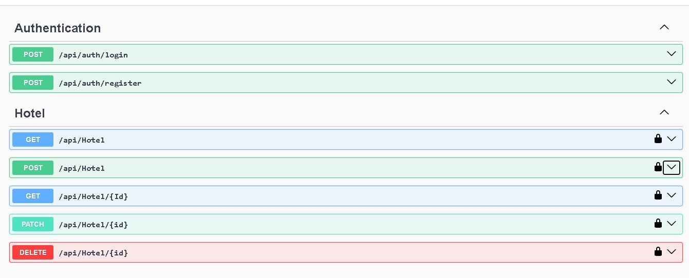
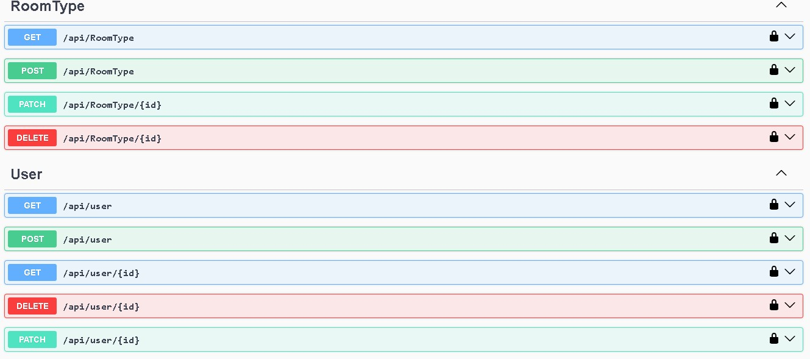

# 🏨 Hotel System API

A robust and scalable Hotel Management System built using ASP.NET Core following Clean Architecture principles.  
This project is designed to manage hotels, rooms, users, and roles efficiently with a secure and maintainable structure.

---

## 🚀 Features

- 🔐 Authentication & Authorization باستخدام JWT
- 👥 Role-based Access Control (Admin / Manager / User / Staff)
- 🏨 Manage Hotels (Create, Update, Delete, Get)
- 🛏️ Manage Rooms And Link with hotel
- 🖼️Upload Hotel Images
- 📄 Pagination 
- ✅ Validation Using FluentValidation
- ⚠️ Global Exception Handling + Custom Errors
- 🎯 Filters (Action FIlter)

---

## 🧱 Architecture

Build Using Clean Archeticture
- (Separation of Concerns)
- (Scalability)
- (Testability)
- Maintainable Code

---

## 🛠️ Tech Stack

- ASP.NET Core Web API
- Entity Framework Core
- SQL Server
- JWT Authentication
- AutoMapper
- FluentValidation

---

## 🧩 Design Patterns

- Repository Pattern
- Unit of Work Pattern
- Dependency Injection (Custom DI)

---

## 🔄 Data Transfer Objects (DTOs)

- Request DTOs
- Response DTOs

---

## ⚙️ Custom Implementations

- Custom Error Handling
- Global Exception Middleware
- Custom Filters
- Custom Dependency Injection Setup

---

## 📌 Example Endpoints

- `POST /api/auth/login`
- `POST /api/hotels`
- `GET /api/hotels`
- `POST /api/rooms`
- `GET /api/rooms`

---
## Screens From Swagger 

## 📈 Future Improvements

-  Logging (Serilog)
- Caching (Redis)
- Integration Tests
- Docker Support

---

## 👨‍💻 Author

Mohamed Khaled  
Full Stack Developer (.NET)
